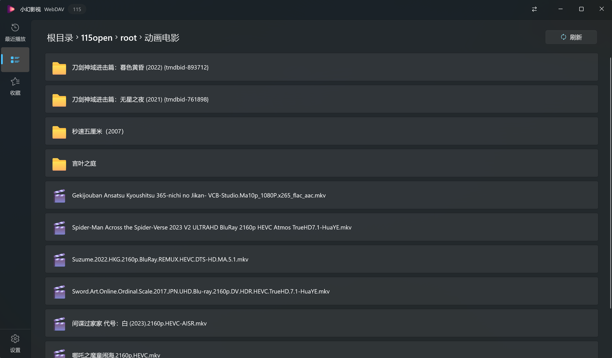

# 小幻影视

畅享你的私人观影时光 — 一款基于 WinUI 3 的现代化 Windows 影视播放器。

[使用文档][docs-link] · [下载应用][store-link] · [更新日志][changelog] · [反馈问题][github-issues-link]

<!-- SHIELD GROUP -->

[![][github-release-shield]][github-release-link]
[![][github-releasedate-shield]][github-releasedate-link] 
[![][github-stars-shield]][github-stars-link]
[![][github-issues-shield]][github-issues-link]

Your personal cinema on Windows

## 👋🏻 概览

小幻影视是一款专注于 Windows 桌面端的影视媒体播放器，以符合 Fluent Design 的现代界面，为你提供高质量的观影体验。

它所支持的服务分为两大类型：

### 🎬 海报墙

即 `Emby` 和 `Jellyfin` 服务，它们部署在本地或服务器，连接数据源后具备视频刮削能力（联网获取封面 / 海报 / 角色等元数据），应用据此生成元素丰富的用户界面，也就是俗称的 `海报墙`。

### 📁 文件浏览

包括 `本地文件`、`WebDAV`、`SMB`、`Alist / OpenList` 和 `115 网盘`。

它们以文件列表的方式展示，用户点选文件以播放，符合传统的文件浏览体验。

> [!TIP]
> 也许你希望小幻影视支持对上述文件类服务进行视频刮削，但这是一件费时费力的事，目前开发者的精力有限，无力承担此项开发工作。

## 🎯 播放

应用内置 libmpv，如果你了解 mpv 配置，可以在此基础上实现丰富的自定义视觉效果。如果你不了解也没关系，应用提供了开箱即用的播放配置，大部分情况下你不需要调整。

> [!Warning]
> 如果你似懂非懂，从其他地方获取了 mpv 配置，那我劝你谨慎。测试期间有相当多的黑屏 / 崩溃都因为使用了错误的配置引起。
> 这部分的问题无法由应用这一侧处理，也难以定位问题，所以在你没有明确目的、同时也不了解你的配置时，请什么都不要做，使用应用的预设配置即可。

如果你坚持使用外部 mpv 接管播放，应用同样支持 — 但**只支持 mpv**，不支持 PotPlayer / VLC 等其他播放器，因为只有 mpv 能完整满足应用所需的双向通信能力（如进度回传）。推荐的 mpv 整合包：[dyphire/mpv-config](https://github.com/dyphire/mpv-config) 与 [hooke007/mpv_PlayKit](https://github.com/hooke007/mpv_PlayKit)（原 mpv lazy）。

## 💬 弹幕

应用支持哔哩哔哩和弹弹 Play 两大弹幕源，这两个服务更多用于动漫资源。如果你有其它资源的需求，应用也支持你自定义弹弹 Play API 地址。

> [!Tip]
> 自定义弹幕 API 要求兼容 [弹弹 Play API v2](https://api.dandanplay.net/swagger/index.html#/) 规范。除了官方推荐的 [anoraker/abetsy](https://hub.docker.com/r/anoraker/abetsy) 之外，也可以考虑社区项目：
>
> - [misaka_danmu_server](https://github.com/l429609201/misaka_danmu_server)
> - [danmu_api](https://github.com/huangxd-/danmu_api)

其中，如果你使用哔哩哔哩弹幕源，最好在设置里登录你的 B 站账号，因为大量资源只有大会员才能够访问，否则你可能只能获得前两分钟试看版本的弹幕。

## 🔗 集成与扩展

- **Trakt** — 可选将观看记录同步到 [Trakt.tv](https://trakt.tv)。
- **聚合搜索** — 一次输入关键词，跨所有在线媒体连接器并行搜索，结果按服务分组展示。
- **跨源切换** — 同一部剧在多个 Emby / Jellyfin 服务之间快速跳转，季 / 集索引自动对齐。
- **协议链接** — 通过 `rodelplayer://` 协议链接，从外部脚本 / 网页一键创建连接器配置，详见[协议链接文档][docs-protocol-link]。

完整使用说明请前往：**<https://player.richasy.net>**

## 📦 安装

## 🐛 反馈与讨论

- 提交 Bug 与功能建议：[Issues][github-issues-link]
- 这是「公开镜像」仓库，仅用于发布 Issue / 维护资源；本体源码不开源。

## 🙏 致谢

- 感谢 [dyphire](https://github.com/dyphire) 和 [未来ガジェット電波局](https://t.me/FG_Radio_Station) 在软件开发期间给予的大力支持。
- 感谢每一位相信开发者并愿意借账户以供测试的同学。
- 感谢所有使用此软件的用户。

除此之外，感谢在软件开发期间所使用的开源库的每一位维护者和贡献者。虽然因为付费原因，小幻影视本体并不开源，但开发过程中创建的组件都会尽量开源，或者在开源软件（比如哔哩助理）中展示实现方式，以回馈开源社区。

## 📝 许可证

Copyright © 2024-2026 [Richasy](https://github.com/Richasy). All rights reserved.

<!-- LINK GROUP -->

[changelog]: https://github.com/Richasy/Rodel.Player/releases
[docs-link]: https://player.richasy.net
[docs-protocol-link]: https://player.richasy.net/zh/docs/reference/protocol-link
[store-link]: https://apps.microsoft.com/detail/9NB0H051M4V4
[github-issues-link]: https://github.com/Richasy/Rodel.Player.Public/issues
[github-issues-shield]: https://img.shields.io/github/issues/Richasy/Rodel.Player.Public?color=ff80eb&labelColor=black&style=flat-square
[github-release-link]: https://github.com/Richasy/Rodel.Player/releases
[github-release-shield]: https://img.shields.io/github/v/release/Richasy/Rodel.Player?color=369eff&labelColor=black&logo=github&style=flat-square
[github-releasedate-link]: https://github.com/Richasy/Rodel.Player/releases
[github-releasedate-shield]: https://img.shields.io/github/release-date/Richasy/Rodel.Player?labelColor=black&style=flat-square
[github-stars-link]: https://github.com/Richasy/Rodel.Player/stargazers
[github-stars-shield]: https://img.shields.io/github/stars/Richasy/Rodel.Player?color=ffcb47&labelColor=black&style=flat-square
