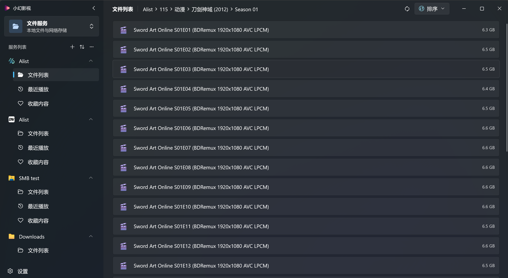

  

# 小幻影视

一款基于 WinUI 3 的现代化 Windows 媒体播放器。 
聚合在线媒体与文件源，使用 libmpv 提供高品质播放体验。

    <a title="Microsoft Store" href="https://apps.microsoft.com/detail/9NB0H051M4V4?launch=true&mode=full" target="_blank">下载应用</a>
    ·
    <a title="Documentation" href="https://player.richasy.net" target="_blank">使用文档</a>
    ·
    <a title="Issues" href="https://github.com/Richasy/Rodel.Player.Public/issues">反馈问题</a>

## 它适合谁

- 自建 Emby / Jellyfin / Plex 服务器，希望在 Windows 上获得**接近原生**且整合度更高的客户端体验
- 习惯用 NAS / 网盘 / WebDAV 整理影视资料，想把它们与在线媒体库放在**同一个播放器**里管理
- 想要一个**以 mpv 为内核**、又有现代 Windows 风格 UI 的播放器，而不是裸 mpv 或纯播放器壳

## 在线媒体

接入你部署在本地或服务器的 **Emby / Jellyfin / Plex**，应用基于服务端刮削好的元数据生成内容丰富的海报墙界面：首页推荐、剧集追番、媒体库浏览、相似推荐、播放历史、详情页（PDP）一应俱全。

详情见文档：[接入在线媒体](https://player.richasy.net/zh/docs/getting-started/online-media)

## 文件源

支持 `本地文件`、`WebDAV`、`SMB`、`Alist / OpenList`、`115 网盘`，按文件夹层级浏览、点选播放，符合传统的文件浏览体验。

> [!TIP]
> 文件类源不做视频刮削。如果你需要"海报墙"般的封面 / 简介，请优先使用 Emby / Jellyfin。

详情见文档：[添加文件源](https://player.richasy.net/zh/docs/getting-started/file-service)

## 播放体验

应用内置 libmpv，提供两种渲染管线：

- **集成模式**：与 WinUI 控件混排，适合一般使用与小窗
- **独立播放**：mpv 独占 swapchain，适合高分辨率高帧率播放

开箱即用的预设无需调整即可满足大多数场景；进阶用户也可以注入自定义 mpv 配置、脚本目录，或者启用 RIFE 补帧、Whisper 实时转写字幕等高级能力。

> [!Warning]
> 如果你似懂非懂，从其他地方获取了 mpv 配置，请谨慎。测试期间相当多的黑屏 / 崩溃都源于错误配置。
> 这部分问题无法由应用侧处理，也难以定位。在你没有明确目的、同时也不了解你的配置时，请使用应用的预设。

如需用外部播放器接管，应用**只支持 mpv**（PotPlayer / VLC 等不在支持范围内），因为只有 mpv 能完整满足应用所需的双向通信能力。推荐 mpv 整合包：[dyphire/mpv-config](https://github.com/dyphire/mpv-config)、[hooke007/mpv_PlayKit](https://github.com/hooke007/mpv_PlayKit)（原 mpv lazy）。

详情见文档：[播放引擎](https://player.richasy.net/zh/docs/playback/engine) · [画质与音质](https://player.richasy.net/zh/docs/playback/quality) · [外部 mpv](https://player.richasy.net/zh/docs/playback/external-mpv)

## 弹幕与字幕

- **弹幕源**：哔哩哔哩、弹弹 Play，以及任何兼容 [弹弹 Play API v2](https://api.dandanplay.net/swagger/index.html#/) 的自托管服务（如 [misaka_danmu_server](https://github.com/l429609201/misaka_danmu_server)、[danmu_api](https://github.com/huangxd-/danmu_api)）。
- **字幕**：内嵌 / 外挂字幕、ASS 样式渲染；可调用 Whisper 模型对无字幕视频进行实时转写。

如果使用哔哩哔哩弹幕源，建议在设置里登录 B 站账号；许多资源仅大会员可访问，否则可能只能获得前两分钟试看版本的弹幕。

详情见文档：[弹幕与字幕](https://player.richasy.net/zh/docs/playback/danmaku-subtitle)

## 还有更多

- **聚合搜索** — 一次输入关键词，跨所有在线媒体连接器并行搜索，结果按服务分组展示
- **跨源切换** — 同一部剧在多个 Emby / Jellyfin 服务之间快速跳转，季 / 集索引自动对齐
- **Trakt 同步** — 可选将观看进度与历史双向同步到 [Trakt.tv](https://trakt.tv)
- **协议链接** — 通过 `rodelplayer://` 一键导入连接器配置
- **设置备份** — 整套设置 / 连接器 / mpv 配置一键导出导入

完整使用说明请前往文档站：**<https://player.richasy.net>**

## 价格模式

应用本体在 Microsoft Store **免费下载**，文件类媒体源与所有高级播放功能开箱即用；**在线媒体服务（Emby / Jellyfin / Plex）需要一次性付费解锁**。完整说明见 [安装与解锁](https://player.richasy.net/zh/docs/getting-started/installation)。

## 反馈

本仓库是公开镜像，仅用于发布资源与收集反馈，本体源码不开源。

- 提交 Bug 与功能建议：[Issues](https://github.com/Richasy/Rodel.Player.Public/issues)

## 致谢

- 感谢 [dyphire](https://github.com/dyphire) 和 [未来ガジェット電波局](https://t.me/FG_Radio_Station) 在软件开发期间给予的大力支持。
- 感谢每一位相信开发者并愿意借账户以供测试的同学。
- 感谢所有使用此软件的用户。

除此之外，感谢在软件开发期间所使用的开源库的每一位维护者和贡献者。虽然小幻影视本体并不开源，但开发过程中创建的组件都会尽量开源，或者在开源软件（比如哔哩助理）中展示实现方式，以回馈开源社区。

## 许可证

Copyright © 2024-2026 [Richasy](https://github.com/Richasy). All rights reserved.
